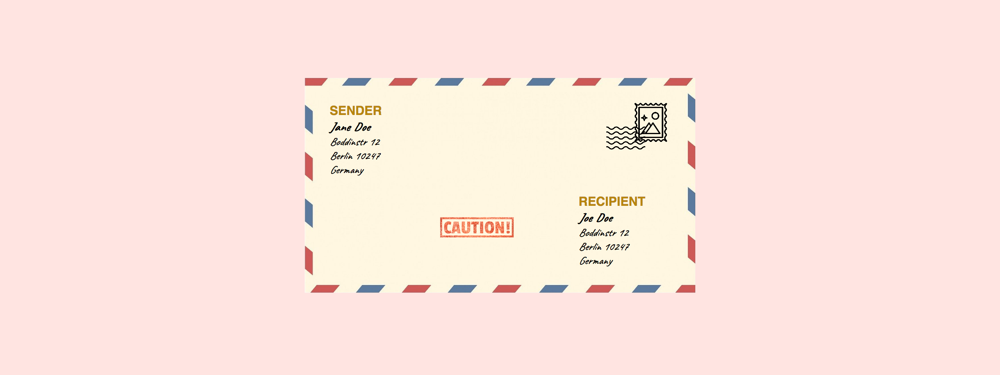

# Envelope

Let's create the following:

Use `position: absolute` to place the addresses and stamps on the right position.
Add the envolep image as `` in the HTML.

- You can also make use of the [address](https://developer.mozilla.org/en-US/docs/Web/HTML/Element/address) element.
- Use custom google fonts to create the handwriting effect.
- No need to make it work on small screens# uib-position-exercise
